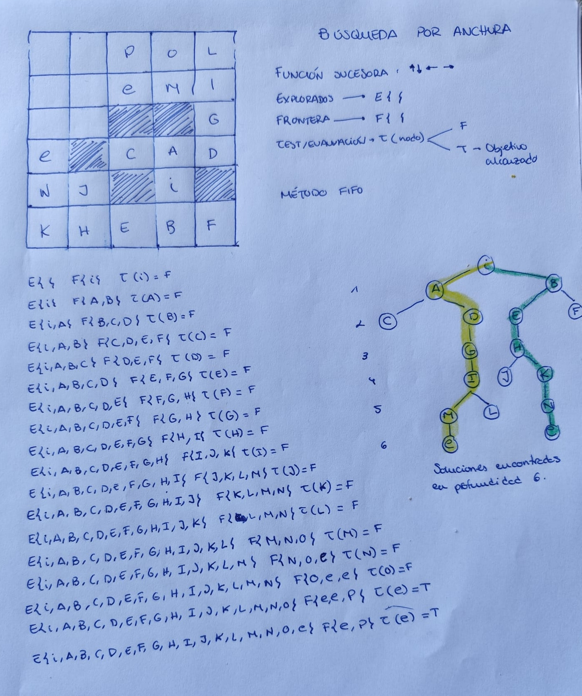
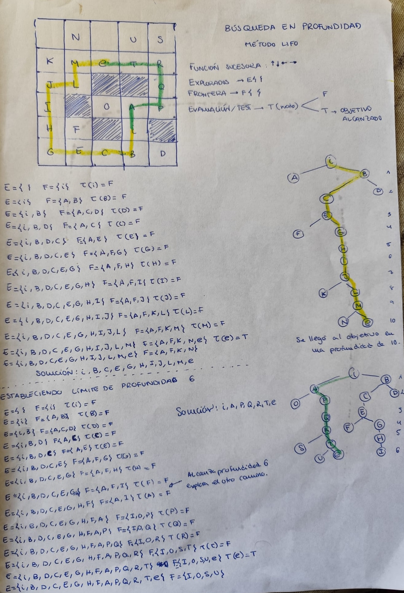
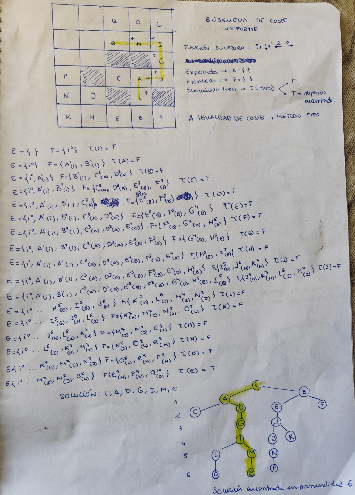
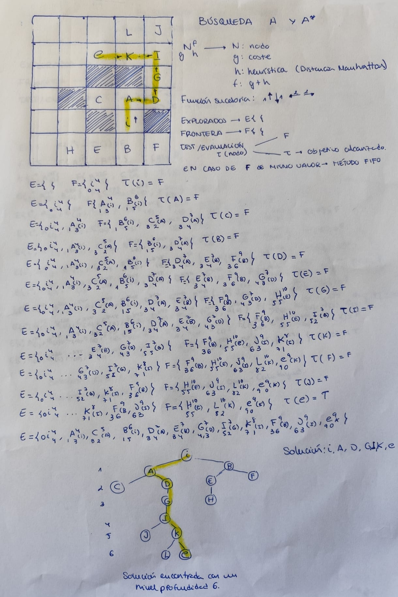

# EJERCICIOS DE BÚSQUEDAS

## Ejercicio 1

Considérese el problema de encontrar un camino, en la situación representada en la figura, desde la posición $i$ hasta la posición $e$. El NPC (*non-player character*) puede moverse de forma horizontal y vertical, un solo cuadrado en cada movimiento (cada movimiento tiene coste uno). Las zonas sombreadas impiden el paso del NPC a través de ellas.

### Algoritmos a aplicar:

Aplicaremos los distintos algoritmos de búsqueda que se tratan en las sesiones del módulo para resolver el problema, en el siguiente orden:

1. Búsqueda en anchura.

2. Búsqueda en profundidad.

- Con límite de profundidad 5 no se alcanza el objetivo, provocando fracaso por valor de corte (en el límite propuesto, no se alcanza el objetivo).
- Con límite 6 se alcanza una solución más eficiente que en la versión sin límite, la cual alcanza el objetivo en profundidad 10.

3. Búsqueda de coste uniforme.

5. Algoritmos **A** y **A***.

## Ejercicio 2

### Preguntas específicas:

#### La heurística utilizada en el algoritmo **A**, ¿es admisible? ¿Por qué?
Sí, la heurística es admisible ya que nunca sobreestima el costo real hacia la meta.

#### ¿Podemos decir que el algoritmo es **A***?   
Sí, usando una heurística admisible logró encontrar la ruta más eficiente (de menor costo).
